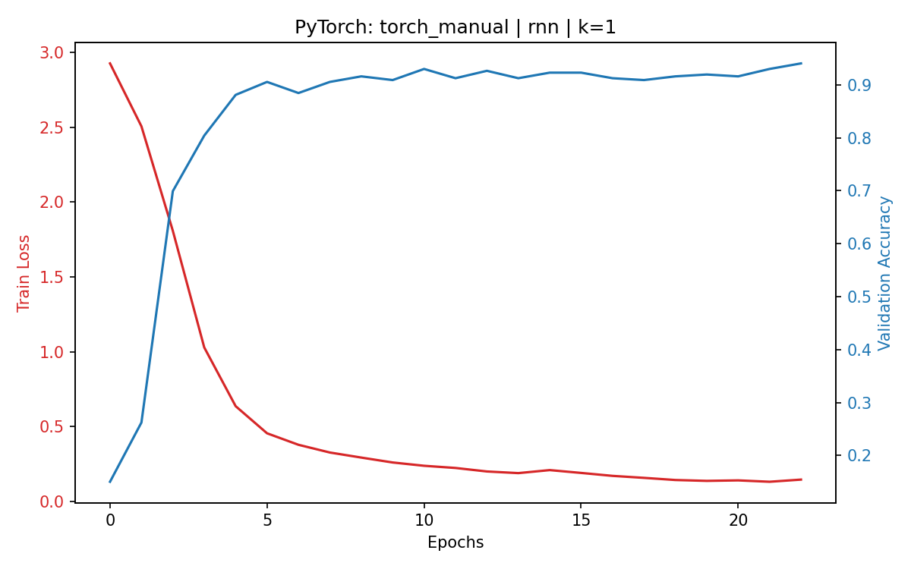
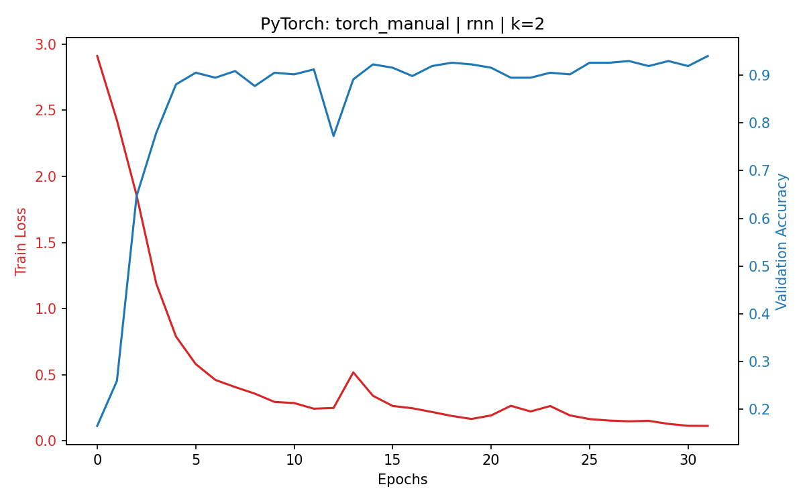
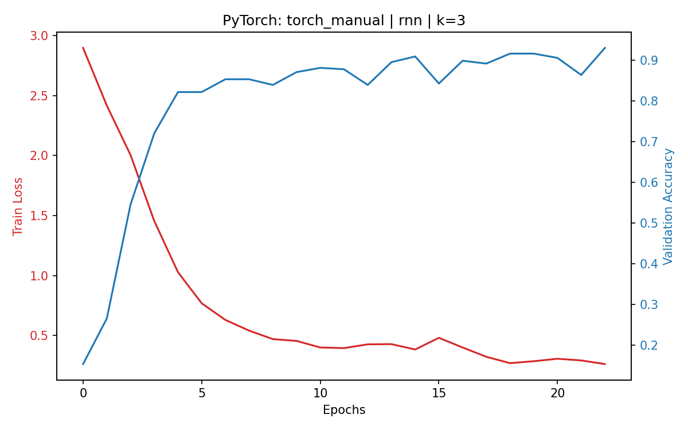
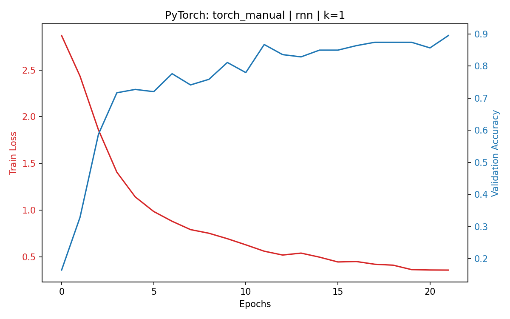
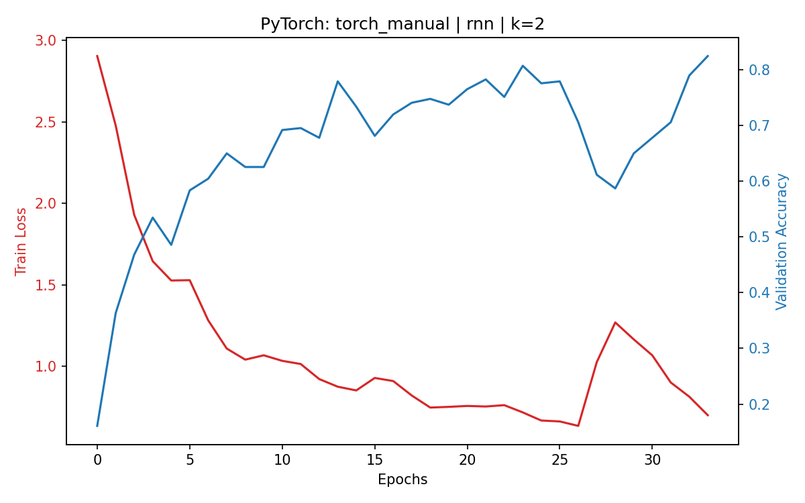
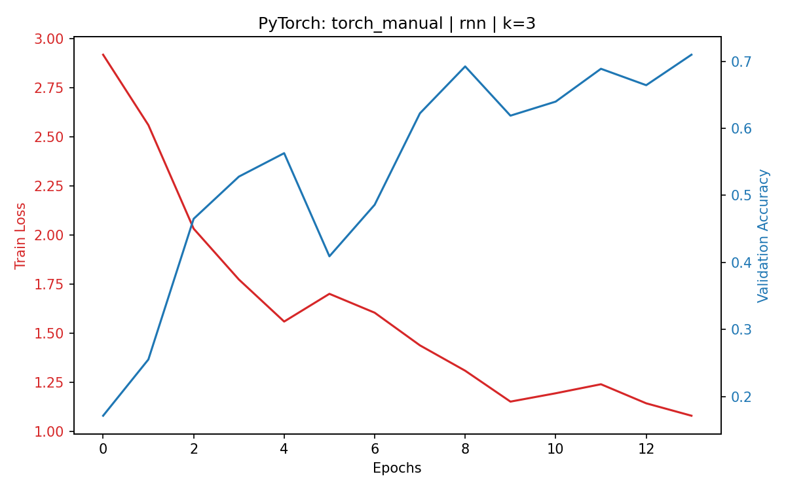

# Implicit Neural Controlled Differential Equations

This repository implements **Parameter-Efficient Neural CDEs via Implicit Function Jacobians**. 

Standard Neural Controlled Differential Equations (NCDEs) require a massive output weight matrix to match the tensor dimensions of the hidden state and the input sequence. This project replaces that matrix with an implicit continuous recurrent step. You compute the hidden trajectory derivative using a Taylor expansion of the implicit function Jacobian. 

This approach cuts the parameter count in half (from ~69K to ~35K) while maintaining state-of-the-art test accuracy.

## Architecture

The codebase provides four distinct execution paths across two deep learning frameworks. 

**PyTorch Implementations:**
* **Manual:** Explicit Jacobian matrix formulation for continuous RNN cells.
* **Autograd:** Forward-mode automatic differentiation (Jacobian-Vector Products) using `torch.func.jvp`. This path supports RNN, GRU, and LSTM cells without requiring explicit matrix derivations.

**JAX Implementations:**
* **Manual:** Explicit Jacobian calculations optimized through XLA compilation (unrolled loops).
* **Autograd:** Native `jax.jvp` integration inside Diffrax ODE solvers. This path supports all cell types.

### The `k_terms` Parameter (Taylor Expansion)
You control the precision of the implicit approximation using the `k_terms` parameter. 
* Setting $k=1$ evaluates the base Jacobian-vector product ($J_x \dot{X}_t$). 
* Setting $k>1$ adds subsequent terms from the Taylor series expansion (e.g., $J_h J_x \dot{X}_t$). 
The codebase supports arbitrary lengths for $k$.

### The `activation` Parameter (Surrogate Gradients)
To train the implicit Jacobian CDE, the autograd engine must compute the **second derivative** of the activation function (to backpropagate through the Jacobian). 
* **`relu`**: The standard ReLU has a second derivative of zero everywhere. This causes catastrophic gradient vanishing in deep layers, crippling the model's ability to learn.
* **`surrogate_relu` (Proposed)**: We replace the backward pass of the ReLU derivative (Heaviside step function) with a continuous **Sigmoid** function. This allows smooth, non-zero gradients to flow back to the network's weights, completely resolving the vanishing gradient problem.

---

## Benchmark Results (CharacterTrajectories)

As shown below, our Jacobian NCDE with `surrogate_relu` matches the Matrix NCDE Baseline while using **~50% fewer parameters**. Using standard `relu` causes the accuracy to collapse, especially at higher $K$ terms.

### Surrogate ReLU (Proposed Method)
| Framework | Model | K | Params | Accuracy |
|:---|:---|:---:|---:|---:|
| **PyTorch** | **Baseline** | **0** | **69,140** | **0.9476** |
| PyTorch | Manual | 1 | 35,988 | 0.9336 |
| PyTorch | Manual | 2 | 35,988 | 0.9196 |
| PyTorch | Manual | 3 | 35,988 | 0.9126 |
| **JAX** | **Baseline** | **0** | **69,012** | **0.9371** |
| JAX | Manual | 1 | 35,988 | 0.9476 |
| JAX | Auto | 1 | 35,988 | 0.9266 |
| JAX | Auto | 2 | 35,988 | 0.9056 |
| JAX | Auto | 3 | 35,988 | 0.9021 |

### Standard ReLU (Ablation)
*Without surrogate gradients, the second derivative vanishes, dropping performance.*

| Framework | Model | K | Params | Accuracy |
|:---|:---|:---:|---:|---:|
| PyTorch | Manual | 1 | 35,988 | 0.8427 |
| PyTorch | Manual | 2 | 35,988 | 0.7552 |
| PyTorch | Manual | 3 | 35,988 | 0.7028 |
| JAX | Manual | 1 | 35,988 | 0.8531 |
| JAX | Auto | 3 | 35,988 | 0.7622 |

---

## Convergence Analysis

Below is a comparison of training curves for the **PyTorch Manual** model across different Taylor expansion terms ($K \in \{1, 2, 3\}$). Notice how the **Surrogate ReLU** maintains stable and high validation accuracy, whereas the standard **ReLU** struggles to learn, suffering from gradient vanishing.

### Surrogate ReLU vs Standard ReLU (PyTorch Manual)

| Activation | $K=1$ | $K=2$ | $K=3$ |
|:---:|:---:|:---:|:---:|
| **Surrogate ReLU**<br>(Stable Learning) |  |  |  |
| **Standard ReLU**<br>(Vanishing Gradients) |  |  |  |

---

## Directory Structure

```text
.
├── configs/
│   └── config.yaml             # Default Hydra configuration
├── src_torch/
│   ├── data.py                 # PyTorch Lightning DataModule
│   ├── cells.py                # RNN, GRU, and LSTM cell definitions
│   ├── lit_module.py           # Lightning wrapper and ODE solver setup
│   ├── models_baseline.py      # Standard Matrix-based NCDE
│   ├── models_manual.py        # Explicit Jacobian PyTorch CDE
│   ├── models_auto.py          # JVP Autograd PyTorch CDE
│   ├── nat_cub_spline.py       # Natural cubic spline interpolation
│   └── train_torch.py          # PyTorch training loop
├── src_jax/
│   ├── cells_jax.py            # Equinox cell definitions
│   ├── models_baseline_jax.py  # Standard Matrix-based NCDE (JAX)
│   ├── models_manual_jax.py    # Explicit Jacobian JAX CDE
│   ├── models_auto_jax.py      # JVP Autograd JAX CDE
│   └── train_jax.py            # Diffrax training loop
├── scripts/
│   ├── run_all.sh              # Full benchmark execution script
│   └── aggregate.py            # Results parser and CSV generator
├── Dockerfile                  # CUDA environment definition
├── launch_container            # Container startup script
└── requirements.txt            # Python dependencies
```

## Environment Setup

Run the code inside the provided Docker environment to ensure CUDA compatibility.

1. Define your user parameters in a `credentials` file:
```bash
DOCKER_USER_ID=$(id -u)
DOCKER_GROUP_ID=$(id -g)
DOCKER_NAME=$USER
CONTAINER_NAME="implicit_cde"
```

2. Build the Docker image:
```bash
chmod +x ./build
./build
```

3. Start the container:
```bash
chmod +x ./launch_container
./launch_container
```

Now you are working in a container with everything needed installed.

## Configuration

Hydra manages the experiment parameters. Edit `configs/config.yaml` to establish baseline settings. 

You can override parameters directly from the command line. This command trains a PyTorch Autograd LSTM model using three Taylor expansion terms, a hidden dimension of 128, and surrogate gradients:

```bash
python src_torch/train_torch.py model=torch_auto cell=lstm k_terms=3 hidden_dim=128 activation=surrogate_relu
```

Supported model configurations:
* `model`: `torch_baseline`, `torch_manual`, `torch_auto`, `jax_baseline`, `jax_manual`, `jax_auto`
* `cell`: `rnn`, `gru`, `lstm`
* `activation`: `surrogate_relu`, `relu`
* `k_terms`: Any integer $\ge 1$ (for manual/auto) or $0$ (for baseline)

## Execution

Execute the complete benchmark suite using the provided shell script:

```bash
CUDA_VISIBLE_DEVICES=0 ./scripts/run_all.sh
```

The script trains models across specified seeds, cell types, activations, and Taylor expansion lengths. It writes JSON logs and loss curves (`.png`) to the `outputs/` directory for every configuration.

Generate the final performance table once the benchmark finishes:

```bash
python scripts/aggregate.py
```
