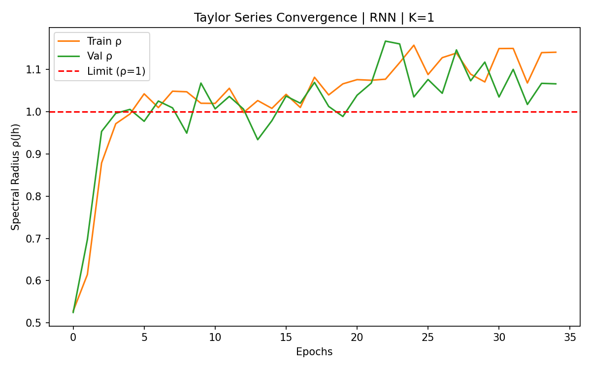
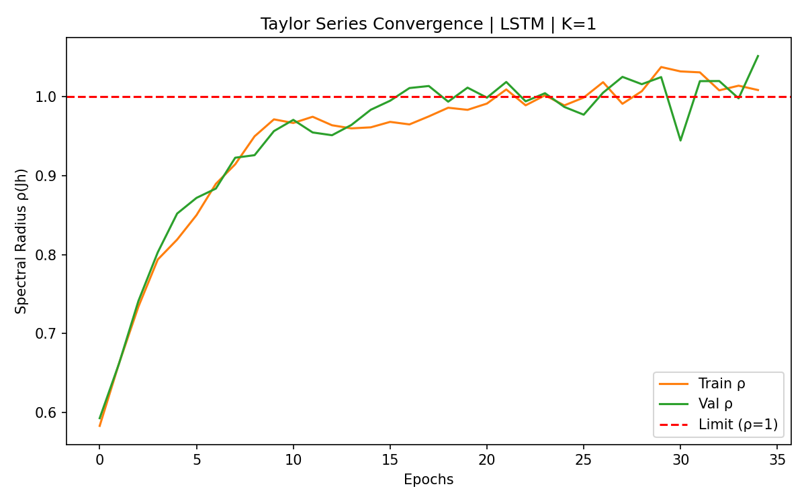
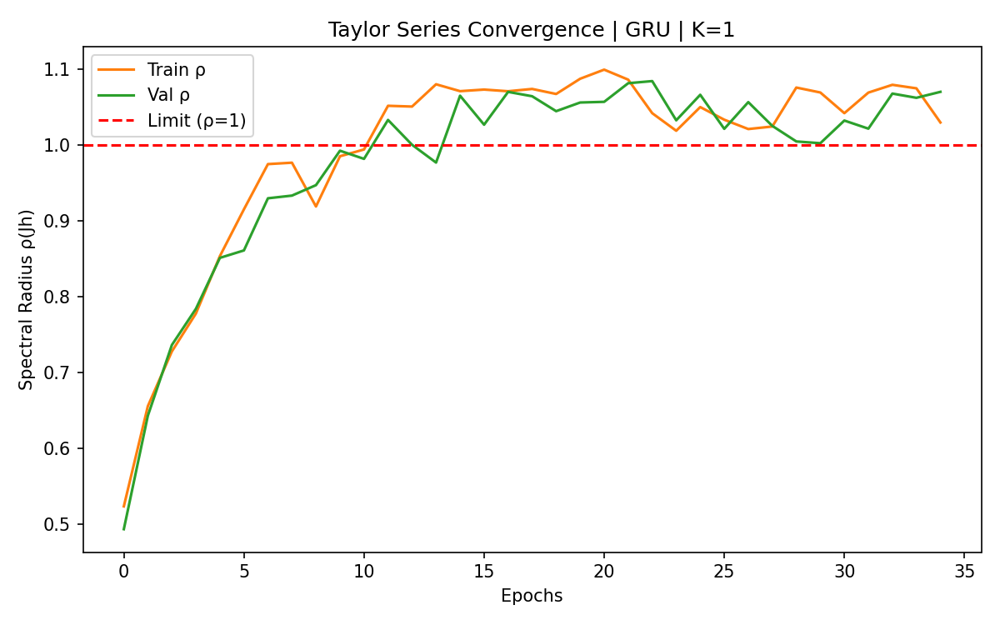

# Implicit Neural Controlled Differential Equations

This repository implements **Parameter-Efficient Neural CDEs via Implicit Function Jacobians**. 

Standard Neural Controlled Differential Equations (NCDEs) require a massive output weight matrix to match the tensor dimensions of the hidden state and the input sequence. This project replaces that matrix with an implicit continuous recurrent step. You compute the hidden trajectory derivative using a Taylor expansion of the implicit function Jacobian. 

This approach significantly cuts the parameter count (e.g., from ~70K to ~36K for RNN/LSTM and ~103K to ~70K for GRU on 3D dataset) while maintaining state-of-the-art test accuracy.

## Architecture

The codebase provides distinct execution paths across two deep learning frameworks. 

**PyTorch Implementations:**
* **Manual:** Explicit Jacobian matrix formulation for continuous RNN cells.
* **Autograd:** Forward-mode automatic differentiation (Jacobian-Vector Products) using `torch.func.jvp`. This path supports RNN, GRU, and LSTM cells without requiring explicit mathematical matrix derivations.

**JAX Implementations:**
* **Manual:** Explicit Jacobian calculations optimized through XLA compilation (unrolled loops).
* **Autograd:** Native `jax.jvp` integration inside Diffrax ODE solvers. This path supports all cell types.

### The `k_terms` Parameter (Taylor Expansion)
You control the precision of the implicit approximation using the `k_terms` parameter. 
* Setting $k=1$ evaluates the base Jacobian-vector product ($J_x \dot{X}_t$). 
* Setting $k>1$ adds subsequent terms from the Taylor series expansion (e.g., $J_h J_x \dot{X}_t$). 

### The `activation` Parameter (Surrogate Gradients)
To train the implicit Jacobian CDE, the autograd engine must compute the **second derivative** of the activation function. 
* **`relu`**: Standard ReLU has a second derivative of zero everywhere. This causes catastrophic gradient vanishing in deep layers.
* **`surrogate_relu` (Proposed)**: We replace the backward pass of the ReLU derivative (Heaviside step function) with a continuous **Sigmoid** function. This allows smooth, non-zero gradients to flow back to the network's weights, ensuring stable convergence.

---

## Benchmark Results (CharacterTrajectories)

As shown below, our Jacobian NCDE with `surrogate_relu` matches the Matrix NCDE Baseline while using **significantly fewer parameters**. The **Time** column represents the relative training duration compared to the baseline model (1.00x) for each respective framework and cell type.

*(Note: Run the `scripts/aggregate.py` script after execution to populate the exact metrics and generate the `benchmark_results.csv` file).*

### 1. RNN Cell Results
Reduction from 69K to 36K parameters (~48% fewer params).

**Surrogate ReLU (Proposed Method)**
| Framework | Model | K | Params | Time | Accuracy |
|:---|:---|:---:|---:|---:|---:|
| **PyTorch** | **Baseline** | **0** | **69K** | **1.00x** | **0.9476** |
| PyTorch | Manual | 1 | 36K | 0.88x | 0.9336 |
| PyTorch | Manual | 2 | 36K | 1.50x | 0.9196 |
| PyTorch | Manual | 3 | 36K | 1.31x | 0.9126 |
| **JAX** | **Baseline** | **0** | **69K** | **1.00x** | **0.9371** |
| JAX | Manual | 1 | 36K | 1.36x | 0.9476 |
| JAX | Manual | 2 | 36K | 1.96x | 0.9196 |
| JAX | Manual | 3 | 36K | 2.37x | 0.8462 |
| JAX | Auto | 1 | 36K | 1.29x | 0.9266 |
| JAX | Auto | 2 | 36K | 1.66x | 0.9056 |
| JAX | Auto | 3 | 36K | 2.68x | 0.9021 |

**Standard ReLU (Ablation)**
| Framework | Model | K | Params | Time | Accuracy |
|:---|:---|:---:|---:|---:|---:|
| PyTorch | Manual | 1 | 36K | 1.63x | 0.8427 |
| PyTorch | Manual | 2 | 36K | 3.24x | 0.7552 |
| PyTorch | Manual | 3 | 36K | 1.50x | 0.7028 |
| PyTorch | Auto | 1 | 36K | 3.76x | 0.8846 |
| JAX | Manual | 1 | 36K | 2.56x | 0.8531 |
| JAX | Manual | 2 | 36K | 2.98x | 0.8182 |
| JAX | Manual | 3 | 36K | 4.10x | 0.6643 |
| JAX | Auto | 1 | 36K | 2.02x | 0.8776 |
| JAX | Auto | 2 | 36K | 3.16x | 0.8986 |
| JAX | Auto | 3 | 36K | 4.05x | 0.7622 |

---

### 2. LSTM Cell Results
Reduction from 70K to 36K parameters (~48% fewer params). Explicit `Manual` Jacobians are omitted for gated architectures due to mathematical complexity.

**Surrogate ReLU (Proposed Method)**
| Framework | Model | K | Params | Time | Accuracy |
|:---|:---|:---:|---:|---:|---:|
| **PyTorch** | **Baseline** | **0** | **70K** | **1.00x** | **0.9349** |
| PyTorch | Auto | 1 | 36K | 2.46x | 0.9380 |
| **JAX** | **Baseline** | **0** | **70K** | **1.00x** | **0.9590** |
| JAX | Auto | 1 | 36K | 1.55x | 0.9523 |
| JAX | Auto | 2 | 36K | 1.97x | 0.9522 |
| JAX | Auto | 3 | 36K | 2.49x | 0.9491 |

**Standard ReLU (Ablation)**
| Framework | Model | K | Params | Time | Accuracy |
|:---|:---|:---:|---:|---:|---:|
| PyTorch | Auto | 1 | 36K | 2.32x | 0.7818 |
| JAX | Auto | 1 | 36K | 1.67x | 0.8288 |
| JAX | Auto | 2 | 36K | 1.92x | 0.7663 |
| JAX | Auto | 3 | 36K | 2.31x | 0.6971 |

---

### 3. GRU Cell Results
Reduction from 103K to 70K parameters (~32% fewer params).

**Surrogate ReLU (Proposed Method)**
| Framework | Model | K | Params | Time | Accuracy |
|:---|:---|:---:|---:|---:|---:|
| **PyTorch** | **Baseline** | **0** | **103K** | **1.00x** | **0.9322** |
| PyTorch | Auto | 1 | 70K | 2.53x | 0.9500 |
| **JAX** | **Baseline** | **0** | **103K** | **1.00x** | **0.9536** |
| JAX | Auto | 1 | 70K | 1.65x | 0.9678 |
| JAX | Auto | 2 | 70K | 2.01x | 0.9510 |
| JAX | Auto | 3 | 70K | 2.47x | 0.9569 |

**Standard ReLU (Ablation)**
| Framework | Model | K | Params | Time | Accuracy |
|:---|:---|:---:|---:|---:|---:|
| PyTorch | Auto | 1 | 70K | 2.42x | 0.8038 |
| JAX | Auto | 1 | 70K | 1.52x | 0.8187 |
| JAX | Auto | 2 | 70K | 2.07x | 0.7874 |
| JAX | Auto | 3 | 70K | 2.43x | 0.7402 |

---

## Convergence & Stability Analysis

### Spectral Radius Tracking
To analyze the behavior of the Taylor series expansion, we track the average maximum eigenvalue (spectral radius $\rho$) of the hidden state Jacobian $J_h$ over the ODE integration steps. Due to the high computational cost of calculating full Jacobian eigenspectrums for every step, $\rho$ is estimated numerically. Specifically, we compute the mathematical expectation of $\rho$ by evaluating a representative subset of trajectories (e.g., 32 trajectories per batch, approx. 25%) with a sampling frequency of 20% across integration steps.

As shown in the plots below, the expected $\rho$ hovers around `1.0` and frequently slightly exceeds `1.0` ($\rho \gtrsim 1.0$). Because the spectral radius is greater than 1, repeatedly multiplying by $J_h$ to compute higher-order Taylor terms ($K=2, 3$) causes the expansion to mathematically diverge rather than converge, which amplifies approximation errors over continuous integration. This behavior directly explains why adding higher $K$ components actually degrades the model's test accuracy.

| RNN (Manual) | LSTM (Auto) | GRU (Auto) |
|:---:|:---:|:---:|
|  |  |  |

### Surrogate Gradients vs Vanishing Gradients
Below is a comparison of training curves for the **PyTorch Manual** RNN model. The **Surrogate ReLU** maintains stable validation accuracy, whereas the standard **ReLU** suffers from gradient vanishing at higher $K$ values.

*(Note: Full training curves (Loss/Accuracy) for all LSTM and GRU models are also generated and saved in the `outputs/` directory but omitted here for brevity).*

| Activation | $K=1$ | $K=2$ | $K=3$ |
|:---:|:---:|:---:|:---:|
| **Surrogate ReLU**<br>(Stable Learning) |  |  |  |
| **Standard ReLU**<br>(Vanishing Gradients) |  |  |  |

---

## Directory Structure

```text
.
├── configs/
│   └── config.yaml             # Default Hydra configuration
├── src_torch/
│   ├── data.py                 # PyTorch Lightning DataModule
│   ├── cells.py                # RNN, GRU, and LSTM cell definitions
│   ├── lit_module.py           # Lightning wrapper and ODE solver setup
│   ├── models_baseline.py      # Standard Matrix-based NCDE
│   ├── models_manual.py        # Explicit Jacobian PyTorch CDE
│   ├── models_auto.py          # JVP Autograd PyTorch CDE
│   ├── nat_cub_spline.py       # Natural cubic spline interpolation
│   └── train_torch.py          # PyTorch training loop
├── src_jax/
│   ├── cells_jax.py            # Equinox cell definitions
│   ├── models_baseline_jax.py  # Standard Matrix-based NCDE (JAX)
│   ├── models_manual_jax.py    # Explicit Jacobian JAX CDE
│   ├── models_auto_jax.py      # JVP Autograd JAX CDE
│   └── train_jax.py            # Diffrax training loop
├── scripts/
│   ├── run_all.sh              # Full benchmark execution script
│   └── aggregate.py            # Results parser and CSV generator
├── Dockerfile                  # CUDA environment definition
├── launch_container            # Container startup script
└── requirements.txt            # Python dependencies
```

## Environment Setup

Run the code inside the provided Docker environment to ensure CUDA compatibility.

1. Define your user parameters in a `credentials` file:
```bash
DOCKER_USER_ID=$(id -u)
DOCKER_GROUP_ID=$(id -g)
DOCKER_NAME=$USER
CONTAINER_NAME="implicit_cde"
```

2. Build the Docker image:
```bash
chmod +x ./build
./build
```

3. Start the container:
```bash
chmod +x ./launch_container
./launch_container
```

## Configuration & Execution

You can override parameters directly from the command line:

```bash
python src_torch/train_torch.py model=torch_auto cell=lstm k_terms=3 hidden_dim=128 activation=surrogate_relu
```

Supported configurations:
* `model`: `torch_baseline`, `torch_manual`, `torch_auto`, `jax_baseline`, `jax_manual`, `jax_auto`
* `cell`: `rnn`, `gru`, `lstm`
* `activation`: `surrogate_relu`, `relu`
* `k_terms`: Any integer $\ge 1$ (for manual/auto) or $0$ (for baseline)

Execute the complete benchmark suite using the provided shell script:

```bash
CUDA_VISIBLE_DEVICES=0 ./scripts/run_all.sh
```

Generate the final performance tables and plots once the benchmark finishes:

```bash
python scripts/aggregate.py
python scripts/replot.py
```